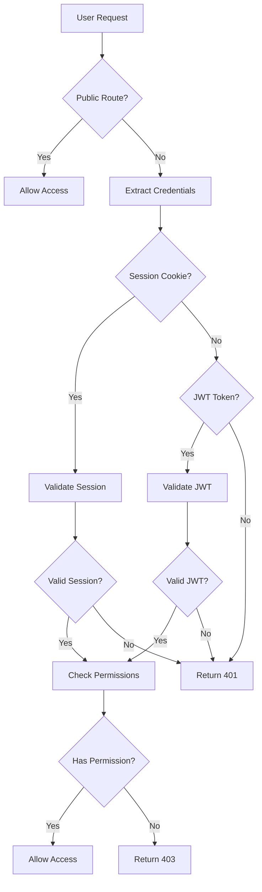

# Unified Authentication System

This document describes the unified authentication system that extends the existing FastAPI JWT authentication to support admin dashboard functionality with role-based access control (RBAC) and unified session management.

## Overview

The unified authentication system provides:

- **Dual Authentication Methods**: Both session-based (cookies) and JWT token authentication
- **Role-Based Access Control (RBAC)**: Fine-grained permissions system with hierarchical roles
- **Unified Session Management**: Cross-system session handling with security features
- **Admin Dashboard Integration**: Seamless authentication for admin dashboard routes
- **Security Features**: Rate limiting, session monitoring, suspicious activity detection

## Architecture

### Core Components

1. **UnifiedAuthService** (`unified_auth.py`): Core authentication service
2. **Authentication Middleware** (`auth_middleware.py`): Request processing middleware
3. **Authentication Routes** (`auth_routes.py`): API endpoints for auth operations
4. **Session Management** (`session_utils.py`): Session lifecycle management
5. **Unified Models** (`unified_models.py`): Database models for users and sessions

### Authentication Flow



## User Roles and Permissions

### Roles Hierarchy

1. **CUSTOMER**: Basic user with limited permissions
2. **AGENT**: Support agent with ticket management permissions
3. **ADMIN**: Administrator with user and system management permissions
4. **SUPER_ADMIN**: Full system access with all permissions

### Permission Categories

#### User Management
- `USER_CREATE`: Create new users
- `USER_READ`: View user information
- `USER_UPDATE`: Modify user details
- `USER_DELETE`: Delete users
- `USER_LIST`: List all users

#### Ticket Management
- `TICKET_CREATE`: Create support tickets
- `TICKET_READ`: View tickets
- `TICKET_UPDATE`: Modify tickets
- `TICKET_DELETE`: Delete tickets
- `TICKET_LIST`: List all tickets
- `TICKET_ASSIGN`: Assign tickets to agents

#### Admin Dashboard
- `DASHBOARD_VIEW`: Access admin dashboard
- `DASHBOARD_ANALYTICS`: View analytics
- `DASHBOARD_REPORTS`: Generate reports

#### System Administration
- `SYSTEM_CONFIG`: Modify system configuration
- `SYSTEM_LOGS`: Access system logs
- `SYSTEM_BACKUP`: Perform backups

## Usage Examples

### Basic Authentication

```python
from backend.unified_auth import auth_service, get_current_user_flexible
from fastapi import Depends

@app.post("/protected-endpoint")
async def protected_route(
    current_user: AuthenticatedUser = Depends(get_current_user_flexible)
):
    return {"message": f"Hello {current_user.username}"}
```

### Permission-Based Access Control

```python
from backend.unified_auth import require_permission, Permission

@app.post("/admin-only")
@require_permission(Permission.DASHBOARD_VIEW)
async def admin_endpoint(current_user: AuthenticatedUser):
    return {"message": "Admin access granted"}
```

### Role-Based Access Control

```python
from backend.unified_auth import require_admin

@app.post("/admin-users")
@require_admin()
async def admin_users_endpoint(current_user: AuthenticatedUser):
    return {"message": "Admin user management"}
```

### Manual Permission Checking

```python
@app.post("/flexible-endpoint")
async def flexible_endpoint(
    current_user: AuthenticatedUser = Depends(get_current_user_flexible)
):
    if current_user.has_permission(Permission.TICKET_CREATE):
        # Allow ticket creation
        pass
    
    if current_user.has_any_permission([Permission.TICKET_READ, Permission.TICKET_LIST]):
        # Allow ticket viewing
        pass
    
    if current_user.has_all_permissions([Permission.USER_READ, Permission.USER_UPDATE]):
        # Allow user management
        pass
```

## API Endpoints

### Authentication Endpoints (`/api/auth/`)

- `POST /api/auth/login`: JSON-based login
- `POST /api/auth/login-form`: Form-based login (legacy compatibility)
- `POST /api/auth/register`: User registration
- `POST /api/auth/logout`: Logout and session invalidation
- `GET /api/auth/me`: Get current user information
- `POST /api/auth/change-password`: Change user password
- `GET /api/auth/sessions`: List user sessions
- `DELETE /api/auth/sessions/{session_id}`: Revoke specific session
- `POST /api/auth/token`: Create JWT token for API access

### Admin Authentication Endpoints (`/admin/auth/`)

- `GET /admin/auth/users`: List all users (admin only)
- `PUT /admin/auth/users/{user_id}`: Update user (admin only)
- `DELETE /admin/auth/users/{user_id}`: Delete user (super admin only)

## Session Management

### Session Features

- **Automatic Expiration**: Sessions expire after configurable time
- **Session Extension**: Extend session lifetime on activity
- **Concurrent Session Limits**: Limit number of active sessions per user
- **Session Monitoring**: Background monitoring and cleanup
- **Security Tracking**: Detect suspicious session activity

### Session Utilities

```python
from backend.session_utils import SessionUtils

# Get active session count
count = SessionUtils.get_active_sessions_count(user_id, db)

# Extend session
SessionUtils.extend_session(session_token, db, extend_hours=2)

# Cleanup expired sessions
SessionUtils.cleanup_expired_sessions(db)

# Enforce session limits
SessionUtils.enforce_session_limit(user_id, db)
```

## Middleware Configuration

### Basic Middleware Setup

```python
from backend.auth_middleware import UnifiedAuthMiddleware

app.add_middleware(
    UnifiedAuthMiddleware,
    admin_routes_prefix="/admin",
    api_routes_prefix="/api",
    public_routes=["/", "/login.html", "/static"],
    require_admin_for_admin_routes=True
)
```

### Permission Middleware

```python
from backend.auth_middleware import PermissionMiddleware
from backend.unified_auth import Permission

route_permissions = {
    "/api/admin/": [Permission.DASHBOARD_VIEW],
    "/api/users/": [Permission.USER_READ],
    "/api/tickets/create": [Permission.TICKET_CREATE]
}

app.add_middleware(
    PermissionMiddleware,
    route_permissions=route_permissions
)
```

## Security Features

### Rate Limiting

```python
from backend.auth_middleware import RateLimitMiddleware

app.add_middleware(
    RateLimitMiddleware,
    max_requests=10,
    window_seconds=300
)
```

### Session Security

```python
from backend.session_utils import SessionSecurity

# Detect suspicious activity
activities = SessionSecurity.detect_suspicious_activity(user_id, db)

# Force logout user
SessionSecurity.force_user_logout(user_id, "Security breach", db)
```

### Background Monitoring

```python
from backend.session_utils import session_monitor

# Start session monitoring
await session_monitor.start_monitoring()

# Stop monitoring
session_monitor.stop_monitoring()
```

## Database Models

### UnifiedUser

Extended user model with role-based permissions:

```python
class UnifiedUser(Base):
    id = Column(Integer, primary_key=True)
    user_id = Column(String(50), unique=True)
    username = Column(String(100), unique=True)
    email = Column(String(255), unique=True)
    password_hash = Column(String(255))
    role = Column(Enum(UserRole))
    is_admin = Column(Boolean)
    is_active = Column(Boolean)
    last_login = Column(DateTime)
    # ... additional fields
```

### UnifiedUserSession

Session management model:

```python
class UnifiedUserSession(Base):
    id = Column(Integer, primary_key=True)
    session_id = Column(String(255), unique=True)
    user_id = Column(Integer, ForeignKey("unified_users.id"))
    token_hash = Column(String(255))
    expires_at = Column(DateTime)
    is_active = Column(Boolean)
    # ... additional fields
```

## Configuration

### Environment Variables

```bash
# JWT Configuration
JWT_SECRET=your-secret-key-change-in-production
JWT_ALGORITHM=HS256
JWT_EXPIRE_HOURS=24

# Session Configuration
SESSION_EXPIRE_HOURS=24
MAX_CONCURRENT_SESSIONS=5

# Security Configuration
RATE_LIMIT_REQUESTS=10
RATE_LIMIT_WINDOW=300
```

### Application Setup

```python
from backend.unified_auth import auth_service
from backend.auth_routes import auth_router, admin_auth_router
from backend.auth_middleware import UnifiedAuthMiddleware

# Configure auth service
auth_service.jwt_secret = os.getenv("JWT_SECRET")
auth_service.token_expire_hours = int(os.getenv("JWT_EXPIRE_HOURS", 24))

# Add routers
app.include_router(auth_router)
app.include_router(admin_auth_router)

# Add middleware
app.add_middleware(UnifiedAuthMiddleware)
```

## Testing

### Running Tests

```bash
# Run all authentication tests
pytest backend/test_unified_auth.py -v

# Run specific test categories
pytest backend/test_unified_auth.py::TestUnifiedAuthService -v
pytest backend/test_unified_auth.py::TestRoleBasedAccessControl -v
pytest backend/test_unified_auth.py::TestSessionUtils -v
```

### Test Coverage

The test suite covers:

- Password hashing and verification
- JWT token creation and validation
- Session management and cleanup
- Role-based access control
- Permission checking
- Middleware functionality
- API endpoint testing
- Integration scenarios

## Migration from Existing System

### Step 1: Update Dependencies

Ensure required packages are installed:

```bash
pip install bcrypt PyJWT python-multipart
```

### Step 2: Database Migration

Run the unified models migration:

```python
from backend.unified_models import Base
from backend.database import engine

# Create unified tables
Base.metadata.create_all(bind=engine)
```

### Step 3: Update Main Application

```python
# Replace existing auth imports
from backend.unified_auth import get_current_user_flexible
from backend.auth_routes import auth_router

# Update route dependencies
@app.get("/protected")
async def protected(user: AuthenticatedUser = Depends(get_current_user_flexible)):
    return {"user": user.username}
```

### Step 4: Update Frontend

Update frontend to use new authentication endpoints:

```javascript
// Login
const response = await fetch('/api/auth/login', {
    method: 'POST',
    headers: {'Content-Type': 'application/json'},
    body: JSON.stringify({username, password})
});

// Get current user
const userResponse = await fetch('/api/auth/me');
const userData = await userResponse.json();
```

## Troubleshooting

### Common Issues

1. **Session Not Found**: Check session cookie configuration and expiration
2. **Permission Denied**: Verify user role and permission assignments
3. **JWT Token Invalid**: Check JWT secret configuration and token expiration
4. **Middleware Not Working**: Ensure middleware is added in correct order

### Debug Mode

Enable debug logging:

```python
import logging
logging.getLogger("backend.unified_auth").setLevel(logging.DEBUG)
logging.getLogger("backend.auth_middleware").setLevel(logging.DEBUG)
```

### Health Checks

```python
@app.get("/health/auth")
async def auth_health_check(db: Session = Depends(get_db)):
    try:
        # Check database connectivity
        db.execute("SELECT 1")
        
        # Check session cleanup
        expired_count = SessionUtils.cleanup_expired_sessions(db)
        
        return {
            "status": "healthy",
            "expired_sessions_cleaned": expired_count,
            "timestamp": datetime.now(timezone.utc)
        }
    except Exception as e:
        return {"status": "unhealthy", "error": str(e)}
```

## Best Practices

1. **Use HTTPS in Production**: Always use HTTPS for authentication endpoints
2. **Rotate JWT Secrets**: Regularly rotate JWT signing keys
3. **Monitor Sessions**: Implement session monitoring and alerting
4. **Limit Session Lifetime**: Use appropriate session expiration times
5. **Implement Rate Limiting**: Protect authentication endpoints from abuse
6. **Log Security Events**: Log all authentication and authorization events
7. **Regular Security Audits**: Periodically review user permissions and sessions

## Future Enhancements

- **Multi-Factor Authentication (MFA)**: Add 2FA support
- **OAuth Integration**: Support for third-party authentication providers
- **Advanced Rate Limiting**: IP-based and user-based rate limiting
- **Session Analytics**: Detailed session usage analytics
- **Audit Logging**: Comprehensive audit trail for all auth events
- **Password Policies**: Configurable password complexity requirements